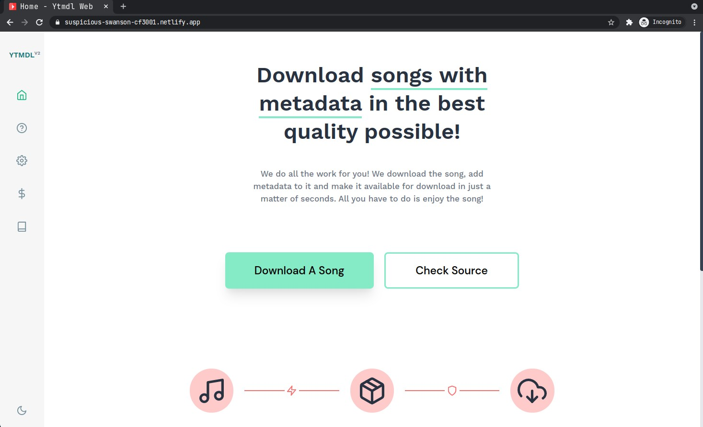

<p align="center">

</p>

## Ytmdl Web V2

Version 2 of Ytmdl Web with a lot of fixes since the first iteration. This release is way faster than the previous version along with some neat additions like Settings.

## Setup

In order to run the project locally, you need to clone the repo and run:

```console
npm i && npm run serve
```

If you want to build, use:

```console
npm run build
```
