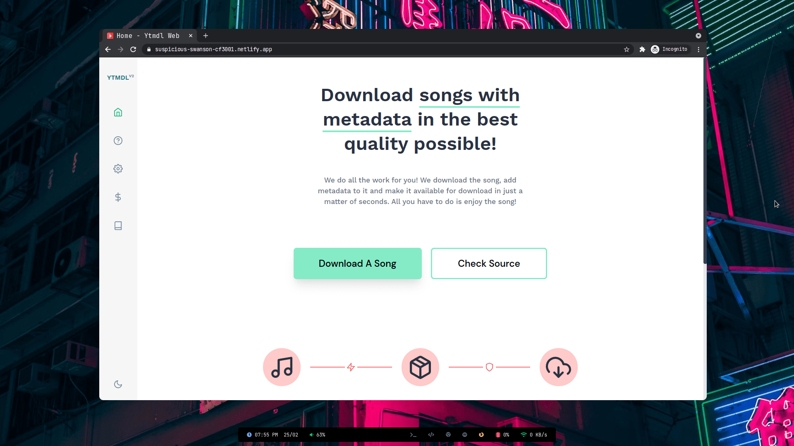

<p align="center">

</p>
<br>

## Ytmdl Web V2

Version 2 of Ytmdl Web with a lot of fixes since the first iteration. This release is way faster than the previous version along with some neat additions like Settings. This Web App is based on the commandline version of the app which can be found [here](https://github.com/deepjyoti30/ytmdl).

### Deploy Locally

If you want to deploy the webapp locally and run it, you can do that by pulling the latest image and deploying it.

```console
docker run -d -p 8082:8082 ghcr.io/deepjyoti30/ytmdl-web:latest 
```

By default the webapp runs on port **8082**.

The latest image is built everytime a merge is done in the `production` branch. If you want to experiment with the bleeding edge and get new features, try out [setup](##setup).

### Setup

In order to run the project locally, you need to clone the repo and run:

```console
git clone git@github.com:deepjyoti30/ytmdl-web-v2 && npm i && npm run serve
```

If you want to build, use:

```console
npm run build
```

### Contribution

If you want to contribute to the project, read the [this](.github/CONTRIBUTING.md).
